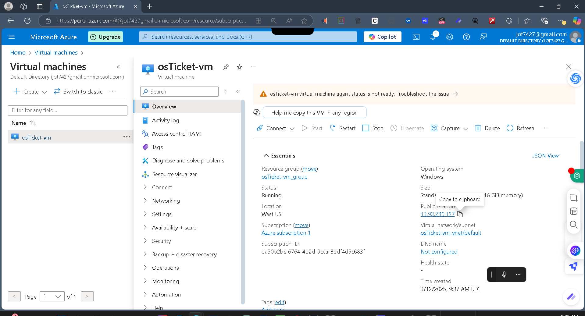

  

# OSTicket Deployment Project (Azure VM)

This project documents the deployment of the open-source support ticket system OSTicket on a Windows 10 virtual machine in Microsoft Azure.

---

## Tools Used

- Microsoft Azure  
- Windows 10 (Azure VM)  
- IIS (Internet Information Services)  
- PHP  
- MySQL (XAMPP / HeidiSQL)  
- OSTicket v1.15.x  
- Remote Desktop (RDP)  

---

## Screenshots

### 1. Azure VM Created  
  
The Azure portal confirms that a Windows 10 VM has been successfully created. The public IP address is visible and will be used to connect remotely and access the OSTicket interface later.

### 2. RDP into Server  
  
RDP session confirms we have connected to the Azure VM. The same public IP appears at the top of the screen, matching the Azure configuration.

### 3. IIS Installed  
  
The IIS Manager confirms that the web server role has been installed and is ready to host PHP-based applications like OSTicket.

### 4. PHP Info Page  
  
A PHP info page loaded through IIS confirms that PHP is installed and running on the web server.

### 5. MySQL Running in XAMPP  
  
XAMPP's MySQL service is running and verified through HeidiSQL. This will store OSTicket's data.

### 6. OSTicket Files Uploaded  
  
The OSTicket application files are extracted into C:\inetpub\wwwroot\osticket, the default web root for IIS.

### 7. OSTicket Web Installer  
  
The OSTicket installer is loaded in the browser from the VM's local web server, confirming that all dependencies (PHP, MySQL, IIS) are connected.

### 8. OSTicket Installation Successful  
  
The system confirms OSTicket is installed. Final permissions and cleanup instructions are shown before admin login.

### 9. Ticket Demo (Optional)  
  
A sample ticket was created in the OSTicket dashboard, showing the system is fully operational and ready for use.

---

## Final Result

OSTicket is now fully deployed and accessible through a web browser using the VM's public IP. This proves the full installation and configuration of a help desk ticketing system on a cloud-hosted Windows environment.

---

## Credits

Built as part of the CourseCareers IT Helpdesk final project.
