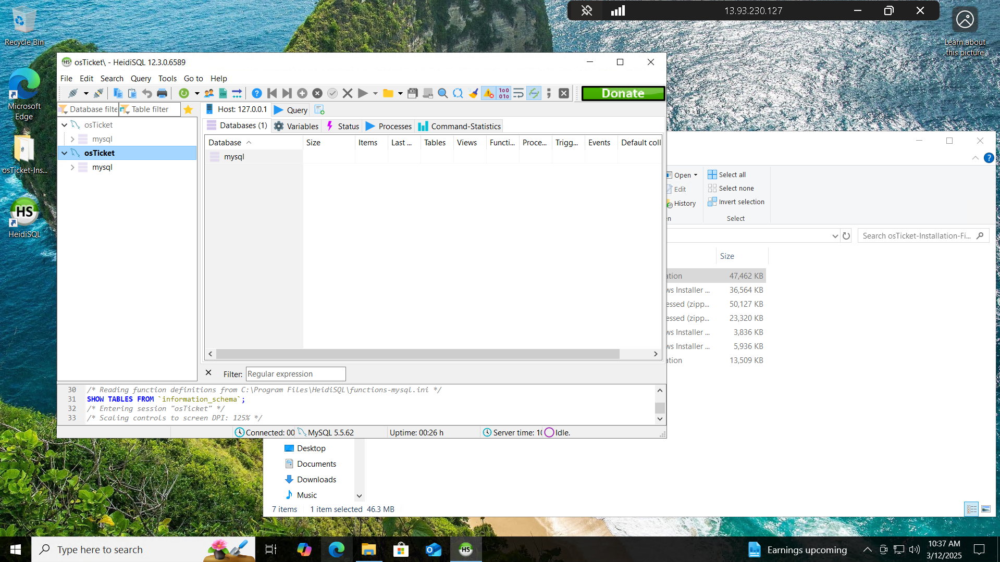

# OSTicket Deployment Project (Azure VM)

This project documents the deployment of the open-source support ticket system **OSTicket** on a Windows Server 2022 virtual machine in Microsoft Azure.

---

## Tools Used

- Microsoft Azure
- Windows Server 2022
- IIS (Internet Information Services)
- PHP
- MySQL (XAMPP / HeidiSQL)
- OSTicket v1.15.x
- Remote Desktop (RDP)

---

## Screenshots

### 1. Azure VM Created  

### 2. RDP into Server  

### 3. IIS Installed  

### 4. PHP Info Page  

### 5. MySQL Running in XAMPP  

### 6. OSTicket Files Uploaded  

### 7. OSTicket Web Installer  

### 8. OSTicket Installation Successful  

### 9. Ticket Demo (Optional)  

### 10. OSTicket Logo  

---

## Final Result

OSTicket is now fully deployed and accessible via a browser using your public VM IP. You can manage support tickets, assign roles, and track issues in real time.

---

## Credits

Built as part of the CourseCareers IT Helpdesk final project.
